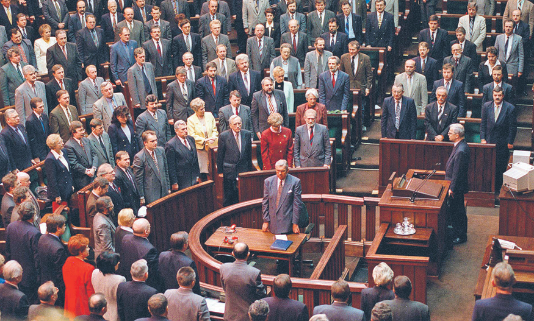

# PODOBIEŃSTWA KONSTYTUCJI 3 MAJA I OBECNEJ {#title}

	
03.05.1791

	
Zamek Królewski - Warszawa

<nav>
	<a href=".">Podobieństwa</a>
	<a href="konstytucja3maja">3 maja</a>
	<a href="konstytucjaAmerykanska">USA</a>
	<a href="konstytucjaFrancuska">Francja</a>
</nav>

---

Konstytucja 3 maja, ustanowiona w 1791 roku, oraz konstytucja RP z 1997 roku mają ze sobą dużo wspólnego, pomimo ponad 200 lat pomiędzu ich uchwaleniem.

## Podobieństwa między konstytucjami:  

* **Trójpodział władzy**: Władza w obu dokumentach została klasycznie podzielona na trzy gałęzie - ustawodawczą, wykonawczą i sądowniczą.  
* **Ochrona praw obywatelskich**: Postawiono duży nacisk na ochronę praw oraz na równość obywateli. Przykładami są zniesienie praw szlacheckich oraz zapewnienie równości wobec prawa.  
* **Suwerenność narodu**: 
* **Reformy systemu**: W obu przypadkach zostały wprowadzone duże zmiany, które miały na celu odbudować kraj i przygotować go na niebezpieczeństwa z zewnątrz.  
* **Demokratyzacja narodu**: Polegało to na przyznaniu większego głosu obywatelom poprzez ograniczenie praw monarchów oraz wprowadzenie pełnej demokracji.