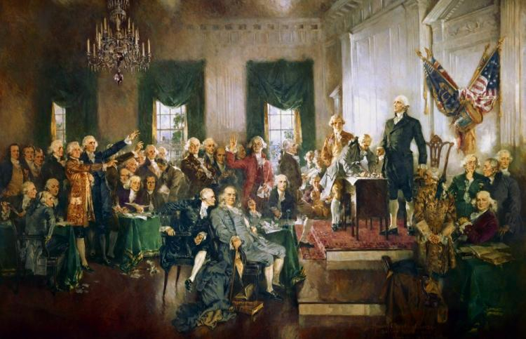

# Konstytucje {#title}

17.09.1789

Waszyngton

---

- [Konstytucja Obecna VS Współczesna](index)
- [Konstytucja 3 maja](kostytucja3maja)
- [Konstytucja Stanów Zjednoczonych](konstytucjaAmerykanska)
- [Konstytucja Francji](konstytucjaFrancuska)

<!-- <nav style="width: 100%;">
	<table style="width: 100%;">
		<tr>
			<td id="link"><a style="font-family: 'Chomsky';" href="konstytucja3maja.html">Konstytucja Obecna VS Współczesna</a></td>
			<td id="link"><a style="font-family: 'Chomsky';" href="konstytucja3maja.html">Konstytucja 3 maja</a></td>
			<td id="link"><a style="font-family: 'Chomsky';" href="konstytucjaAmerykanska.html">Konstytucja Stanów Zjednoczonych</a></td>
			<td id="link"><a style="font-family: 'Chomsky';" href="konstytucja3maja.html">Konstytucja Francji</a></td>
		</tr>
	</table>
</nav> -->

# KONSTYTUCJA STANÓW ZJEDNOCZONYCH - WARTOŚCI PONADCZASOWE

Konstytucja Stanów Zjednoczonych, uchwalona 17 września 1787 roku, jest pierwszą na świecie nowoczesną ustawą zasadniczą, która została spisana i oparta na ideałach oświecenia. Weszła w życie 4 marca 1789 roku, stając się podstawą ustroju politycznego i prawnego Stanów Zjednoczonych

## Ponadczasowe Wartości i Rozwiązania:

* **Premambuła**: Podkreśla znaczenie wolności i sprawiedliwości, stanowiąc podstawę dla wszystkich innych praw i wolności.
* **Zasady Ustrojowe**: Trójpodział władzy (ustawodawcza, wykonawcza, sądownicza), federalizm, nadrzędność Konstytucji i elastyczność poprzez poprawki.
* **Ochrona Praw Miejszości**: Poprawka XIV - Zakaz dyskryminacji, zapewniający równość wobec prawa.
* **Edukacja Obywatelska**: Edukacja na temat praw i obowiązków obywatelskich, kluczowa dla funkcjonowania demokracji.
* **Podstawowe Prawa Obywatelskie**: Wolność słowa i prasy, gwarantowana przez I poprawkę.
* **Równość wobec Prawa**: Równa ochrona prawa, zapewniająca wszystkim obywatelom równy dostęp do prawa.
* **Prawa Polityczne i Społeczne**: XIII poprawka, znosząca niewolnictwo, jako ważny krok w kierunku równości społecznej.

Konstytucja Stanów Zjednoczonych, uchwalona 17 września 1787 roku, była ważnym krokiem w kierunku modernizacji systemu politycznego i prawnego w Stanach Zjednoczonych. Choć pierwotnie miała być dokumentem tymczasowym, przetrwała ponad 230 lat, stając się podstawą dla rozwoju demokracji na świecie.

