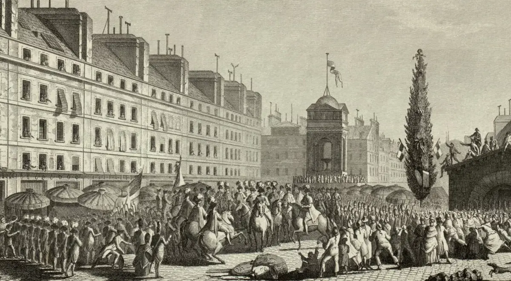

# Konstytucje {#title}

03.09.1791

Paryż

---

- [Konstytucja Obecna VS Współczesna](index)
- [Konstytucja 3 maja](kostytucja3maja)
- [Konstytucja Stanów Zjednoczonych](konstytucjaAmerykanska)
- [Konstytucja Francji](konstytucjaFrancuska)

<!-- <nav style="width: 100%;">
	<table style="width: 100%;">
		<tr>
			<td id="link"><a style="font-family: 'Chomsky';" href="konstytucja3maja.html">Konstytucja Obecna VS Współczesna</a></td>
			<td id="link"><a style="font-family: 'Chomsky';" href="konstytucja3maja.html">Konstytucja 3 maja</a></td>
			<td id="link"><a style="font-family: 'Chomsky';" href="konstytucjaAmerykanska.html">Konstytucja Stanów Zjednoczonych</a></td>
			<td id="link"><a style="font-family: 'Chomsky';" href="konstytucja3maja.html">Konstytucja Francji</a></td>
		</tr>
	</table>
</nav> -->

# KONSTYTUCJA FRANCUSKA - WARTOŚCI PONADCZASOWE

Konstytucja 3 maja uchwalona 3 maja 1791 roku była drugą na świecie i pierwszą w Europie nowoczesną konstytucją. Wprowadzała ustrój monarchii konstytucyjnej, trójpodział władzy oraz zniosła liberum veto i wolną elekcję króla.

## Podstawowe Zasady Konstytucji 3 Maja:

* **Religia (chrześcijańska) i wiara**: Konstytucja respektowała religię chrześcijańską jako podstawę moralności społecznej.
* **Suwerenność i wolność narodu**: Podkreślała znaczenie suwerenności narodu i jego wolności.
* **Pamięć o przodkach i tradycja**: Zachowywała pamięć o przodkach i tradycji narodowej.
* **Wolność wszystkich obywateli**: Przewidywała zwiększenie wolności obywatelskich, choć z ograniczeniami w zależności od stanu.
* **Możliwość swobodnego przemieszczania się**: Zapewniała swobodne przemieszczanie się w granicach państwa.
* **Naród wybiera rządzących krajem**: Zniósł wolną elekcję króla i liberum veto, wprowadzając dziedziczność tronu.
* **Sprawiedliwy sąd i brak osądu bez procesu**: Gwarantowała sprawiedliwość sądownictwa i ochronę przed arbitralnymi osądami.
* **Ochrona praw ludzkich**: Przewidywała ochronę podstawowych praw ludzkich.
* **Patriotyzm i walka o kraj w razie potrzeby**: Zachęcała do patriotyzmu i obrony kraju w sytuacjach zagrożenia.

Konstytucja 3 maja była ważnym krokiem w kierunku modernizacji państwa polskiego, choć jej obowiązywanie było krótkie, zaledwie 14 miesięcy, do 23 listopada 1793 roku.