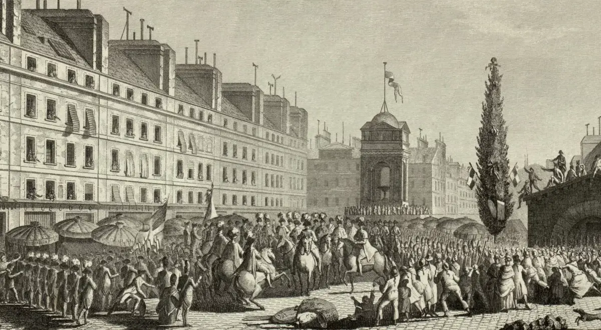

# KONSTYTUCJA FRANCUSKA - WARTOŚCI PONADCZASOWE {#title}

	
03.09.1791

	
Paryż

<nav>
	<a href=".">Podobieństwa</a>
	<a href="konstytucja3maja">3 maja</a>
	<a href="konstytucjaAmerykanska">USA</a>
	<a href="konstytucjaFrancuska">Francja</a>
</nav>

---

Konstytucja francuska z 1791 roku wprowadziła zasady ograniczające władzę monarchy i zapewniające prawa obywatelskie, takie jak trójpodział władzy i suwerenność narodu. Jej ponadczasowe wartości, m.in. Deklaracja Praw Człowieka, miały kluczowy wpływ na rozwój nowoczesnych demokracji.

## Podstawowe Zasady Konstytucji Francuskiej:

- **Deklaracja Praw Człowieka i Obywatela**: Stanowiła fundament wolności, równości i braterstwa, zapewniając podstawowe prawa jednostki i obywatele, niezależnie od stanu społecznego.
- **Trójpodział władzy**: Wprowadzenie zasady rozdzielenia władzy na ustawodawczą, wykonawczą i sądowniczą miało na celu zapobieganie tyranii i zapewnienie równowagi w rządzeniu.
- **Suwerenność narodu**: Zasada, że naród jest źródłem wszelkiej władzy, a nie monarcha, co umocniło ideę demokracji i władzy ludu.
- **Ograniczenie władzy monarchy**: Przemiany w systemie politycznym, które zmniejszyły absolutną władzę monarchy na rzecz parlamentu, wprowadzając monarchię konstytucyjną.
- **Prawo wyborcze (Demokracja)**: Rozpoznanie podstawowego prawa obywateli do wyboru swoich przedstawicieli w instytucjach rządowych, co stanowiło krok ku pełniejszej demokracji.

Konstytucja francuska z 1791 roku wprowadziła fundamentalne zasady nowoczesnego państwa, takie jak trójpodział władzy, suwerenność narodu, ograniczenie władzy monarchy oraz prawa człowieka, a także wprowadziła podstawy demokracji poprzez prawo wyborcze dla obywateli.
